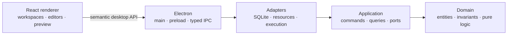

<div align="center">

# Showflow

### Design once. Produce many.

Showflow is a local-first desktop production workspace for creators who design,
prepare, preview, and rehearse recurring shows.


[](https://github.com/RasheedLewis/showflow/actions/workflows/quality.yml)

[Product](#the-product) · [Architecture](#architecture) · [Documentation](#documentation) · [Roadmap](#roadmap) · [Contributing](#contributing)

</div>

> [!IMPORTANT]
> **Showflow is building its engineering foundation.** The authoritative product
> specifications and delivery plan are in place, and the Electron, Vite, and React
> desktop shell now runs and packages. Security, typed IPC, package boundaries,
> quality tooling, test harnesses, and continuous integration are in place.

## The product

Traditional broadcasting tools organize work around scenes, sources, filters,
encoders, and routing. Showflow uses the language and workflow of a producer:

1. Design the reusable structure of a **Show**.
2. Create an **Episode** from its default **Show Blueprint**.
3. Replace this episode's content and adjust its **Storyboard**.
4. Preview **Segments**, **Layouts**, and **Host Cues**.
5. Rehearse the episode without broadcasting.

The MVP is built for a solo creator who wants to focus on content, pacing, and
the audience—not broadcast-engineering vocabulary.

```text
Design the reusable Show
        ↓
Create an Episode from the Blueprint
        ↓
Replace content and adjust the Storyboard
        ↓
Preview and rehearse
        ↓
Host the Show
```

### Core concepts

| Concept             | Responsibility                                                     |
| ------------------- | ------------------------------------------------------------------ |
| **Studio**          | Top-level workspace for a creator, brand, or organization          |
| **Show**            | Recurring production that owns reusable assets and Episodes        |
| **Show Blueprint**  | Default ordered Storyboard copied into new Episodes                |
| **Show Segment**    | Reusable definition for one meaningful part of a Show              |
| **Episode**         | One specific production instance of a Show                         |
| **Episode Segment** | Episode-specific content and approved overrides for a Show Segment |
| **Layout**          | Reusable, constrained screen composition                           |
| **Slot**            | Named position or region within a Layout                           |
| **Component**       | Reusable visual, media, or input element                           |
| **Resource**        | Image, video, audio, camera, text, font, or structured data        |
| **Host Cue**        | Optional manual action while a Segment is active                   |
| **Lifecycle**       | Fixed `Prepare → Enter → Active → Exit → Cleanup` flow             |

> The canonical product term is **Segment**. “Moment” is not a v1 domain term,
> and “scene” or “source” should not appear in the primary user experience.

### MVP boundaries

| Included in the Producing MVP                           | Deliberately deferred                            |
| ------------------------------------------------------- | ------------------------------------------------ |
| Studios, Shows, Blueprints, and Episodes                | Live streaming and recording                     |
| Reusable Segments, Layouts, Components, and Resources   | OBS or Restream integration                      |
| Episode Storyboard editing                              | Cloud sync and collaboration                     |
| Fixed Segment lifecycle and Layout activation           | Remote guests and mobile apps                    |
| Component enter/exit presets and Host Cues              | Keyframes and multitrack timelines               |
| Preview, validation, autosave, undo/redo, and rehearsal | General vector design or post-production editing |

<details>
<summary><strong>What success looks like</strong></summary>

A creator can create a Studio and Show, design reusable Segments and Layouts,
arrange a Blueprint, create an Episode from it, fill in episode-specific content,
preview lifecycle behavior, trigger Host Cues, rehearse the complete episode,
quit, and return without losing work.

The workflow must remain understandable without knowledge of OBS, and the same
codebase must package for macOS, Windows, and Linux.

</details>

## Experience principles

- **Storyboard first:** the Blueprint and Episode Storyboard are the primary
  visual representations of a production.
- **Reuse over one-offs:** Segments, Layouts, and Components live at Show scope,
  even when their creation begins inside an Episode.
- **One hero per screen:** the current production object stays visually dominant.
- **Scope is always visible:** users can tell whether a change affects the Show,
  future Episodes, or only the current Episode.
- **Production language:** validation explains what is missing, where it occurs,
  what it blocks, and how to fix it.
- **Constrained creativity:** Showflow composes production elements; it does not
  recreate Figma, Canva, Premiere, or After Effects.

The design language is dark-first, calm, spacious, and production-focused. It
combines blueprint precision, storyboard sequence, canvas focus, and the state
awareness of a production console. Geist is the specified typeface, and a
restrained gold accent is reserved for attention, selection, and current state.

## Architecture

Showflow is a local-first Electron application with a strict boundary
between reusable product logic and desktop concerns.



### Approved technical baseline

| Area                     | Decision                                                                                  |
| ------------------------ | ----------------------------------------------------------------------------------------- |
| Desktop runtime          | Electron 43.3.0 with Electron Forge 7.11.2                                                |
| Build pipeline           | Vite 8.2.0 with separate main, preload, and renderer entries                              |
| UI                       | React, TypeScript, hash-based React Router                                                |
| Workspace                | pnpm workspaces with one root lockfile                                                    |
| Code quality             | Strict TypeScript, ESLint flat config, typescript-eslint, React Hooks rules, and Prettier |
| Validation               | Zod at IPC, persistence, import, and settings boundaries                                  |
| Persisted renderer state | TanStack Query                                                                            |
| Transient editor state   | Zustand                                                                                   |
| Forms                    | React Hook Form where multi-field validation warrants it                                  |
| Accessible primitives    | Radix UI wrapped in Showflow components                                                   |
| Styling                  | CSS Modules and centralized CSS custom-property tokens                                    |
| Drag and drop            | `@dnd-kit`, subject to an early interaction spike                                         |
| Persistence              | SQLite; validate `node:sqlite`, then use the approved fallback if needed                  |
| Testing                  | Vitest, React Testing Library, Playwright, and a small Electron smoke suite               |
| Reference toolchain      | Node 24.18.0 and pnpm 11.4.0; macOS on Apple Silicon is the quality-reference platform    |

The initial dark visual foundation is exposed by `@showflow/ui` through the
[central token stylesheet](packages/ui/src/tokens.css). Renderer styles consume
semantic `--sf-*` custom properties rather than maintaining feature-local color,
spacing, radius, or motion values.

### Required repository shape

```text
showflow/
├── AGENTS.md                # Repository-wide coding-agent instructions
├── apps/
│   └── desktop/             # Electron main, preload, and React renderer
├── packages/
│   ├── domain/              # Pure entities, invariants, and transformations
│   ├── application/         # Use cases, commands, queries, and ports
│   ├── contracts/           # IPC DTOs and runtime schemas
│   ├── persistence/         # SQLite adapter and migrations
│   ├── resources/           # Resource import and lookup
│   ├── execution-contracts/ # Renderer-independent production instructions
│   ├── ui/                  # Shared Showflow UI and tokens
│   └── test-fixtures/       # Deterministic fixtures
├── docs/                    # Product, UX, technical, design, and delivery specs
├── migrations/              # Immutable numbered SQL migrations
└── scripts/                 # Repository automation
```

### Non-negotiable boundaries

```text
React component
  → versioned window.showflow API
    → typed and validated IPC handler
      → application command
        → repository interface
          → SQLite adapter
```

- The renderer has no direct Node.js access.
- The main window loads local content only, denies child windows and unexpected
  navigation, and sends approved HTTPS links to the operating-system browser.
- Domain and application packages do not import Electron, React, Node file APIs,
  or SQLite.
- Persistent mutations pass through application use cases.
- IPC exposes narrow semantic methods, never a generic arbitrary channel.
- The versioned preload bridge currently exposes only
  `window.showflow.app.getRuntimeInfo()` and validates its result at runtime.
- IDs are stable UUIDs; timestamps are ISO 8601 UTC strings.
- Episode creation from a Blueprint is transactional.
- Preview and rehearsal share deterministic, cancellable runtime logic.
- OBS-specific types never enter the core domain.

## Documentation

The specifications are authoritative in the following order when they conflict:

1. [Architecture PRD v1.3](docs/architecture-prd-v1.3.md) — domain ownership, terminology, invariants, and MVP scope.
2. [MVP UX Specification v1.0](docs/ux-spec-v1.0.md) — user-facing workflows, screen behavior, accessibility, and open interactions.
3. [Technical Specification v1.0](docs/technical-spec-v1.0.md) — stack, package boundaries, persistence, security, testing, and distribution.
4. [Design System Specification v1.0](docs/design-system-spec-v1.0.md) — visual foundations, components, tokens, motion, and content voice.

The [Detailed Implementation Plan v1.0](docs/implementation-plan-v1.0.md)
defines delivery order, test gates, and decision timing. It must conform to the
four specifications above and does not override them. See the
[documentation guide](docs/README.md) for terminology, open-specification, and
versioning rules. The [decision register](docs/decisions/README.md) indexes
accepted ADRs and provides templates for product decision requests and open
specification issues.

> [!NOTE]
> Items marked **OPEN SPECIFICATION** are not permission to invent permanent
> behavior. Use a documented MVP default, isolate a neutral placeholder, hide the
> feature, or record the decision that is still needed.

### Suggested reading paths

| If you are…            | Read in this order                                                                               |
| ---------------------- | ------------------------------------------------------------------------------------------------ |
| New to the product     | This README → Architecture PRD → UX Specification                                                |
| Implementing a feature | Architecture section → relevant UX section → Technical section → Design section → current Sprint |
| Reviewing architecture | Architecture PRD → Technical Specification → implementation plan                                 |
| Reviewing UI           | UX Specification → Design System → relevant acceptance criteria                                  |
| Planning delivery      | Implementation Plan → [decision register](docs/decisions/README.md) → deferred backlog           |

## Getting started

### Bootstrap the workspace

```bash
git clone <repository-url>
cd showflow

# Use the versions pinned by .node-version and package.json
node --version # v24.18.0
pnpm --version # 11.4.0

pnpm install --frozen-lockfile
```

The workspace includes the initial Electron desktop shell. Start it with
`pnpm dev`; package it locally with `pnpm package`; or create the installer format
for the current platform with `pnpm make`.

### Development commands

The technical specification requires one obvious root command for each common
task. Desktop build, code-quality, Vitest, Testing Library, and Playwright
commands are available from the repository root.

```bash
pnpm dev
```

| Command                  | Purpose                                               | Status    |
| ------------------------ | ----------------------------------------------------- | --------- |
| `pnpm dev`               | Start the Electron desktop app in development mode    | Available |
| `pnpm build`             | Build every workspace package                         | Available |
| `pnpm package`           | Package the desktop app locally                       | Available |
| `pnpm make`              | Produce platform installer artifacts                  | Available |
| `pnpm test:boundaries`   | Verify package and Electron process import boundaries | Available |
| `pnpm typecheck`         | Run strict TypeScript checks in every workspace       | Available |
| `pnpm lint`              | Run the repository lint rules                         | Available |
| `pnpm format`            | Format supported repository files                     | Available |
| `pnpm format:check`      | Verify formatting without modifying files             | Available |
| `pnpm test`              | Run unit and renderer test suites                     | Available |
| `pnpm test:unit`         | Run focused Vitest unit tests                         | Available |
| `pnpm test:renderer`     | Run Testing Library renderer tests                    | Available |
| `pnpm test:coverage`     | Generate unit and renderer coverage reports           | Available |
| `pnpm test:e2e`          | Build and run all Playwright tests                    | Available |
| `pnpm test:e2e:browser`  | Run the browser renderer suite                        | Available |
| `pnpm test:e2e:electron` | Package and run the Electron smoke suite              | Available |

### Continuous integration

The read-only [Pull Request Quality workflow](.github/workflows/quality.yml)
runs frozen installation, formatting, linting, strict typechecking, unit and
renderer tests, architecture boundaries, and the production build. It runs for
pull requests and updates to `main`.

The [Unsigned Platform Packages workflow](.github/workflows/package-platforms.yml)
is a manual placeholder that packages nonrelease artifacts on macOS arm64,
Windows x64, and Linux x64. It does not publish, sign, or notarize releases.

## Roadmap

Development is divided into gated vertical slices. Each Sprint must ship a
coherent increment, tests, documentation updates, and no regressions before the
next Sprint begins.

| Phase              | Sprints | Outcome                                                                     |
| ------------------ | ------: | --------------------------------------------------------------------------- |
| Foundation         |     0–3 | Secure Electron shell, persistence proof, domain kernel, and design system  |
| Design a Show      |     4–5 | Studios, Shows, Segment Catalog, and Show Blueprint                         |
| Produce an Episode |     6–9 | Episode Storyboard, Segment editors, content, and Resources                 |
| Compose and run    |   10–14 | Layouts, Components, bindings, lifecycle, Host Cues, and rehearsal          |
| Release candidate  |   15–16 | Accessibility, performance, security hardening, and cross-platform packages |

<details>
<summary><strong>View the complete Sprint sequence</strong></summary>

- [ ] **Sprint 0:** Repository and secure Electron foundation
- [ ] **Sprint 1:** Persistence proof and database foundation
- [ ] **Sprint 2:** Domain and application kernel
- [ ] **Sprint 3:** Design system foundation and application shell
- [ ] **Sprint 4:** Studios, Shows, and Show Detail
- [ ] **Sprint 5:** Segment Catalog and Show Blueprint
- [ ] **Sprint 6:** Episodes and Episode Storyboard
- [ ] **Sprint 7:** Show Segment schema and behavior editor
- [ ] **Sprint 8:** Episode Segment content editor
- [ ] **Sprint 9:** Resource system
- [ ] **Sprint 10:** Layout Catalog and constrained Layout editor
- [ ] **Sprint 11:** Components, Placements, and bindings
- [ ] **Sprint 12:** Preview runtime and Segment lifecycle
- [ ] **Sprint 13:** Host Cues
- [ ] **Sprint 14:** Episode rehearsal
- [ ] **Sprint 15:** Hardening, accessibility, and performance
- [ ] **Sprint 16:** Cross-platform release candidate

</details>

The full gates, subtasks, tests, and decision timing live in the
[Detailed Implementation Plan](docs/implementation-plan-v1.0.md).

## Contributing

This project is still establishing its foundation. Before proposing code or a
specification change, read the repository-wide [agent instructions](AGENTS.md)
and then:

1. Read the authoritative documents relevant to the change.
2. Preserve canonical terminology and Show-level ownership rules.
3. Identify any **DECISION REQUIRED** or **OPEN SPECIFICATION** boundary.
4. Implement the smallest coherent vertical slice.
5. Add tests with the behavior and update affected documentation.
6. Verify keyboard, focus, reduced-motion, loading, empty, error, and success states.

### Definition of done

A contribution is not complete until:

- [ ] strict TypeScript, formatting, and linting pass;
- [ ] trust-boundary inputs are runtime-validated;
- [ ] relevant unit, integration, renderer, and end-to-end tests exist;
- [ ] domain rules are enforced below the UI layer;
- [ ] user-facing copy uses production terminology;
- [ ] design values come from centralized tokens; and
- [ ] no open product decision has been silently finalized.

> [!WARNING]
> Do not add broadcasting, cloud, mobile, collaboration, general-purpose canvas,
> timeline, or automation features to the Producing MVP without a new approved
> specification.

## Security and privacy

The MVP is local-first and requires no account, cloud database, telemetry, or
secrets. Its Electron security baseline requires context isolation, sandboxing,
no renderer Node integration, a restrictive content security policy, sender and
payload validation for privileged IPC, and an allowlisted resource protocol.

Please do not commit databases, imported media, environment files, signing
certificates, tokens, or personal production data. The repository's
[`.gitignore`](.gitignore) excludes common local and generated artifacts.

## License

No license has been selected yet. Until one is added, the repository should not
be assumed to grant permission to copy, modify, or redistribute the project.[^license]

---

<div align="center">

**Showflow** — the quiet control room behind a great live production.

</div>

[^license]: Choosing and adding a license is a product-owner decision required before public distribution.
